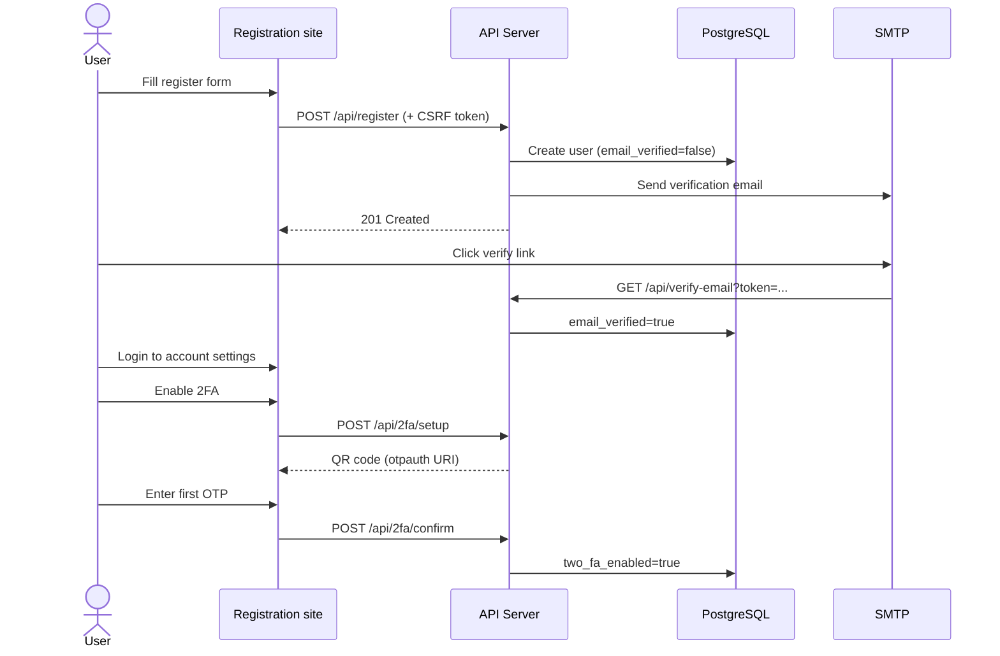

# Registration Website — Architecture & Concept

Registration runs **exclusively in the browser**. The Windows client only links to `registration_url` from `config.json`.

---

## User flows



---

## Pages

### 1. `/register`

| Field | Validation |
|-------|------------|
| Username | 3–50 chars, `[a-zA-Z0-9_]` |
| Email | Valid RFC 5322 format, unique |
| Password | Min 12 chars, upper + lower + digit + symbol |
| Confirm password | Must match |

- CSRF hidden field (`csrf_token` cookie + header double-submit)
- Client-side + server-side validation
- On success → “Check your email” page (no auto-login)

### 2. `/verify-email`

- Link format: `https://yourdomain.com/verify-email?token=<opaque>`
- Token: 256-bit random, SHA-256 hashed in DB, expires in 24 h
- Single use; invalid/expired → error page with “Resend” option

### 3. `/account/security` (authenticated via web session)

- Toggle 2FA → shows QR code (TOTP secret via `otpauth://` URI)
- User scans with Authenticator app
- Confirms with 6-digit code → `two_fa_enabled = true`

### 4. `/login` (web only, optional)

For account management in browser — **separate** from the Windows client session.

---

## Suggested API endpoints (web-only)

```
POST /api/register
  Body: { username, email, password, csrf_token }
  → 201 { message: "Verification email sent" }

GET  /api/verify-email?token=...
  → 302 redirect to success/error page

POST /api/register/resend-verification
  Body: { email }
  → 200 (always generic message — no email enumeration)

POST /api/2fa/setup        (Bearer or web session)
  → 200 { otpauth_uri, secret_preview }

POST /api/2fa/confirm      (Bearer or web session)
  Body: { otp }
  → 200 { two_fa_enabled: true }
```

These endpoints are **not** called by the Windows client.

---

## Database additions (future migration)

```sql
CREATE TABLE email_verification_tokens (
    id UUID PRIMARY KEY DEFAULT gen_random_uuid(),
    user_id UUID REFERENCES users(id) ON DELETE CASCADE,
    token_hash TEXT UNIQUE NOT NULL,
    expires_at TIMESTAMPTZ NOT NULL,
    used BOOLEAN DEFAULT FALSE,
    created_at TIMESTAMPTZ DEFAULT NOW()
);

CREATE TABLE web_sessions (
    id UUID PRIMARY KEY DEFAULT gen_random_uuid(),
    user_id UUID REFERENCES users(id) ON DELETE CASCADE,
    session_hash TEXT UNIQUE NOT NULL,
    expires_at TIMESTAMPTZ NOT NULL,
    created_at TIMESTAMPTZ DEFAULT NOW()
);
```

---

## Security requirements

| Control | Implementation |
|---------|----------------|
| CSRF | Double-submit cookie or synchronizer token |
| Rate limiting | 5 req / 15 min per IP on `/register` |
| HTTPS | Caddy + HSTS |
| Password storage | Argon2id (same as login API) |
| Email enumeration | Generic responses (“If account exists…”) |
| Verification tokens | Opaque, SHA-256 hashed, single-use, 24 h TTL |
| Content Security Policy | `default-src 'self'` via Helmet/Caddy |
| Input sanitization | Zod schemas server-side |

---

## Tech stack (recommended)

| Layer | Choice |
|-------|--------|
| Frontend | Static HTML + minimal JS, or Next.js/Astro |
| Hosting | Same vServer behind Caddy (`yourdomain.com → :8080`) |
| Email | SMTP (e.g. Resend, Mailgun, or self-hosted Postfix) |
| Styling | Match client aesthetic (dark, `#0a0a0f`, accent `#00d4ff`) |

---

## Caddy routing

```caddy
yourdomain.com {
    reverse_proxy 127.0.0.1:8080   # static site or Next.js
}

api.yourdomain.com {
    reverse_proxy 127.0.0.1:3000   # existing auth API
}
```

---

## Client integration

The Windows client opens registration via:

```cpp
ShellExecuteA(nullptr, "open", config.registration_url.c_str(), ...);
```

Set in `config.json`:

```json
"registration_url": "https://yourdomain.com/register"
```
